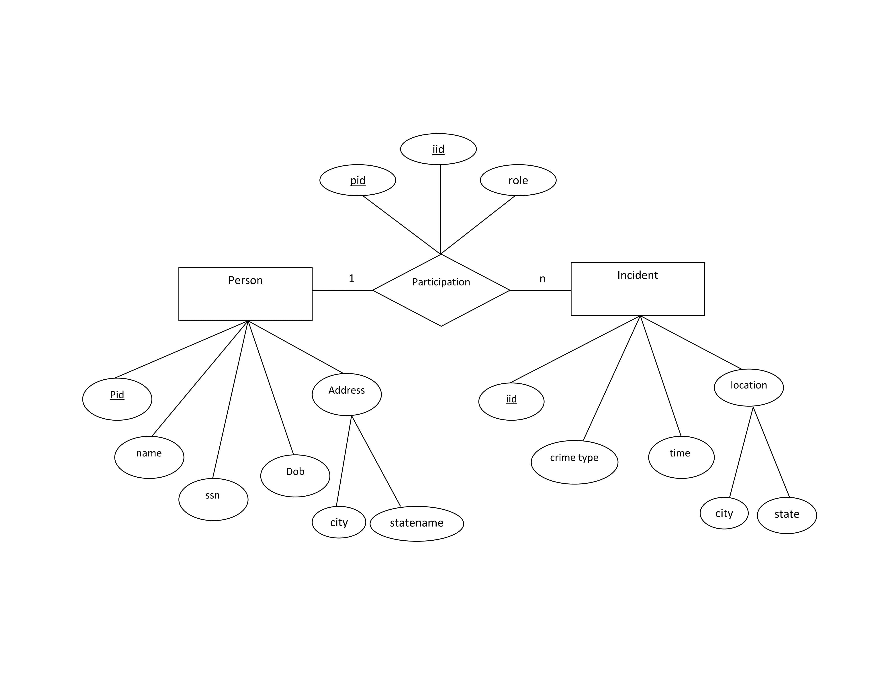
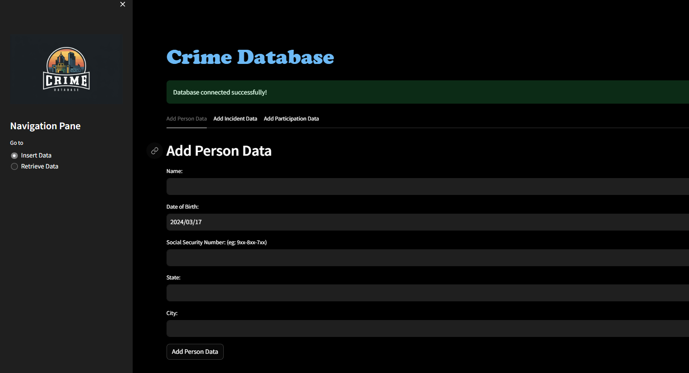

# Crime Database Project

## Overview

This project aims to develop a comprehensive crime database system that allows users to efficiently manage and analyze crime-related data. The system provides functionalities for storing information about various criminal incidents, suspects, victims, witnesses, and other relevant entities. 
## Features

- **Data Entry**: Easily input and update information about criminal incidents, suspects, victims, etc.
- **Search and Retrieval**: Quickly find and retrieve specific records based on various criteria.

## ER Diagram



Insert ER diagram image here.

## Web Application Screenshots

### Dashboard



Insert screenshot of the dashboard here.


## Installation and Setup

1. Clone the repository:

    ```bash
    git clone https://github.com/your-username/crime-database.git
    ```

2. Install dependencies:

    ```bash
    pip install -r requirements.txt
    ```

3. Configure database connection settings in `config.py`.

4. Run the application:

    ```bash
    streamlit run app.py
    ```

## Technologies Used

- Python
- Streamlit
- db2
- pandas

## Contributors

- Sachin V Bacha (@bachasachin0)
  

## License

This project is licensed under the MIT License - see the [LICENSE](LICENSE) file for details.
